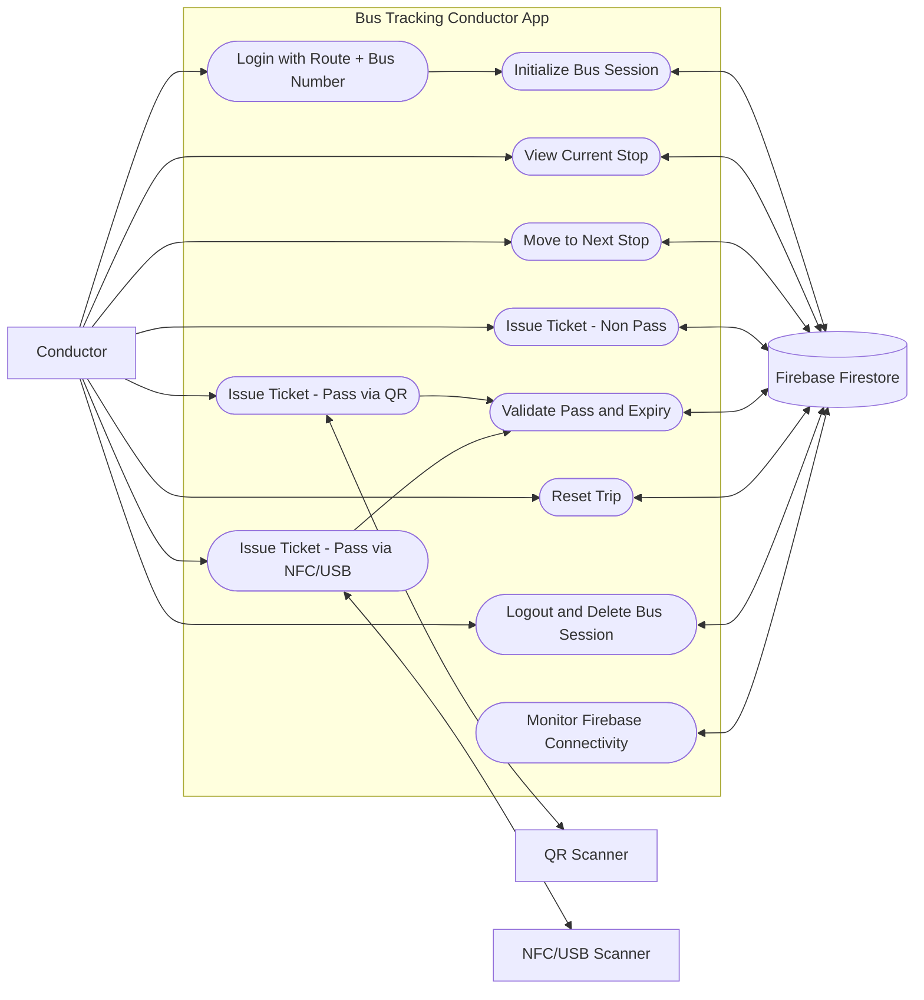
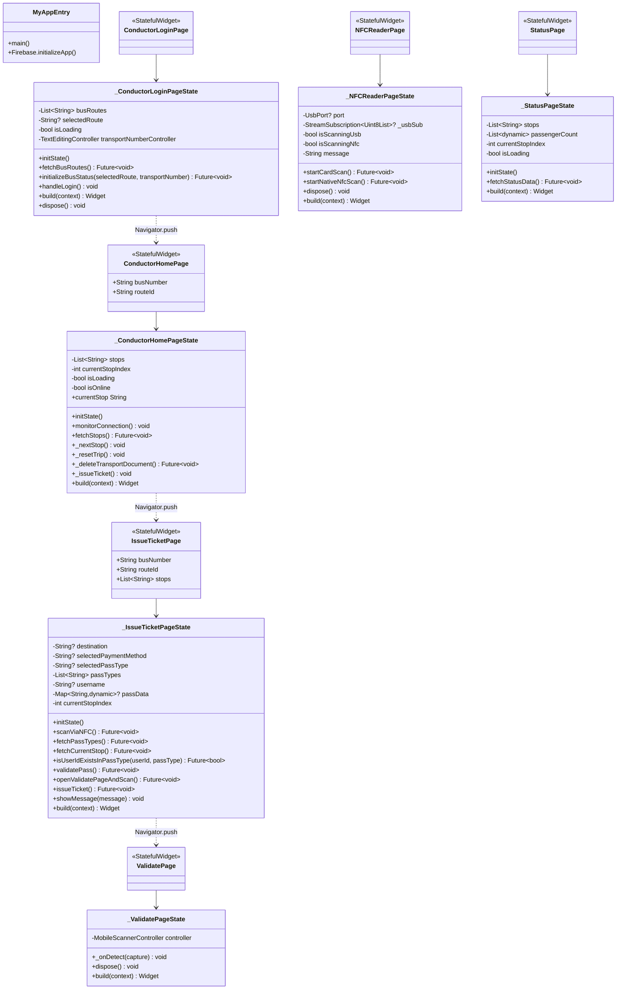
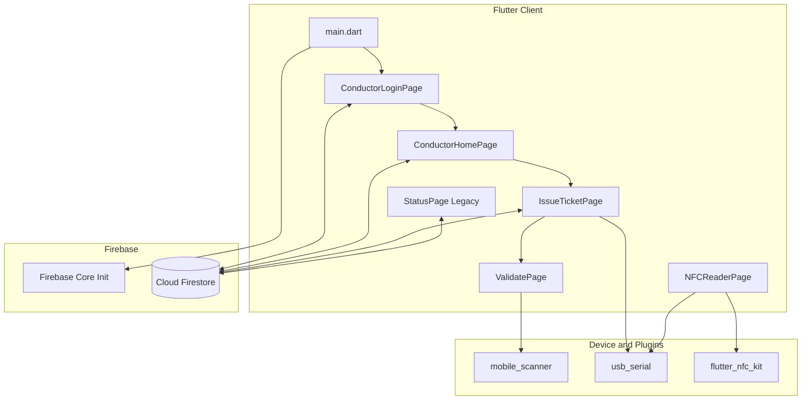
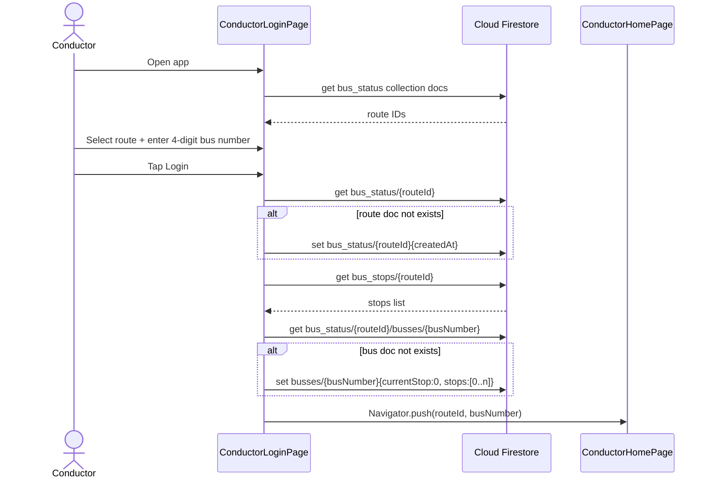
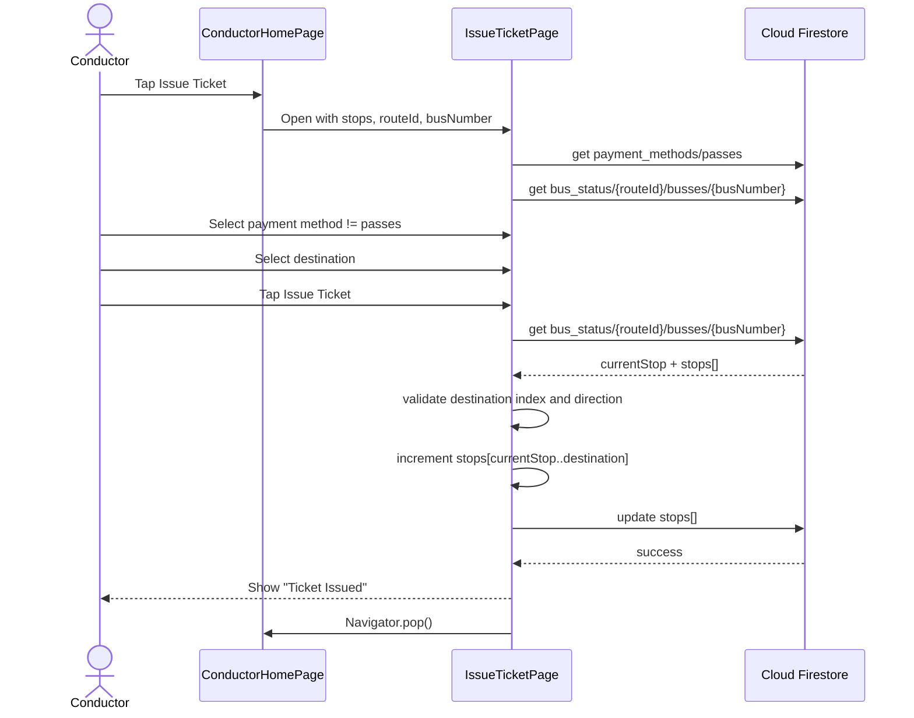
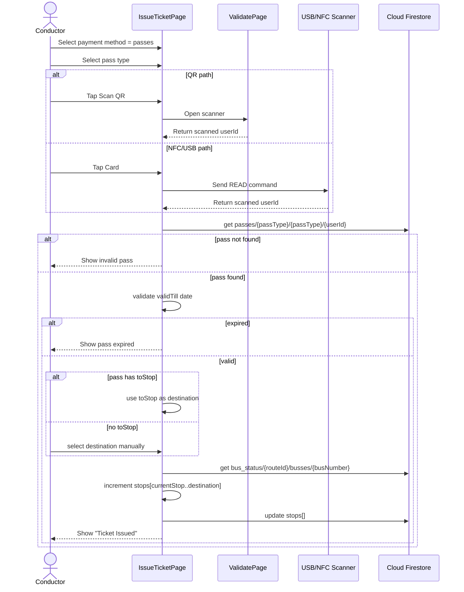
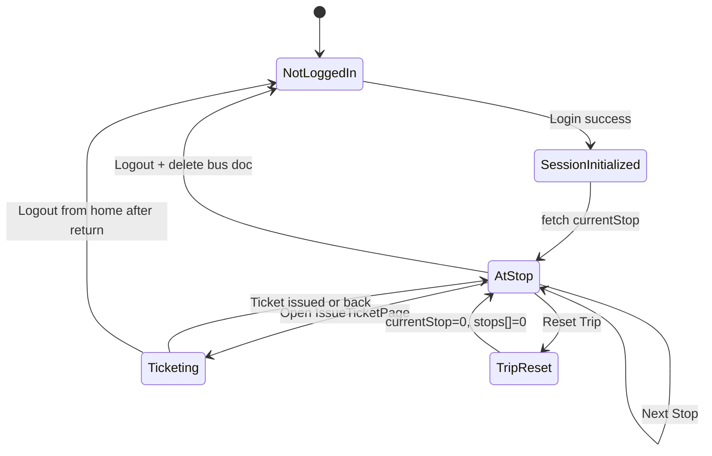
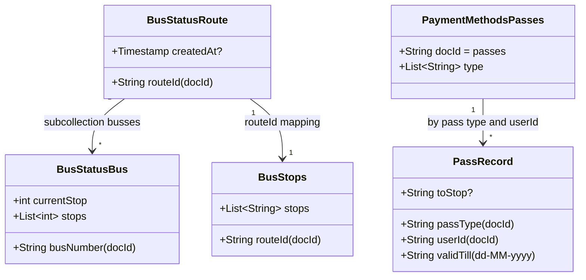

# BusTrackPlus Conductor App UML Diagrams

These UML diagrams are derived from the current codebase:
- `lib/main.dart`
- `lib/screens/conductor_login_page.dart`
- `lib/screens/conductor_home_page.dart`
- `lib/screens/issue_ticket_page.dart`
- `lib/validate.dart`
- `lib/nfc_reader_page.dart`
- `lib/status_page.dart`

## 1. Use Case Diagram



## 2. Class Diagram (Application Classes)



## 3. Component Diagram



## 4. Sequence Diagram - Login and Bus Session Initialization



## 5. Sequence Diagram - Issue Ticket (Cash/Non-Pass)



## 6. Sequence Diagram - Issue Ticket (Pass via QR/NFC)



## 7. Activity Diagram - End-to-End Conductor Workflow

```mermaid
flowchart TD
    A([Start App]) --> B[Initialize Firebase]
    B --> C[Open ConductorLoginPage]
    C --> D[Fetch route IDs from bus_status]
    D --> E{Route selected?}
    E -- No --> E1[Show error] --> C
    E -- Yes --> F{4-digit bus number valid?}
    F -- No --> F1[Show error] --> C
    F -- Yes --> G[Initialize bus session docs]
    G --> H[Open ConductorHomePage]

    H --> I[Fetch stops + currentStop]
    I --> J{Action?}

    J -->|Next Stop| K[Increment currentStop in Firestore]
    K --> J

    J -->|Reset Trip| L[Set currentStop=0 and reset stops[]]
    L --> J

    J -->|Issue Ticket| M[Open IssueTicketPage]
    M --> N{Payment method}

    N -->|Non-pass| O[Select destination]
    O --> P[Issue ticket and update stops[]]
    P --> J

    N -->|Passes| Q[Select pass type]
    Q --> R{Scan source}
    R -->|QR| S[Scan via ValidatePage]
    R -->|NFC/USB| T[Scan card]
    S --> U[Validate pass in Firestore]
    T --> U

    U --> V{Pass valid and not expired?}
    V -- No --> V1[Show error] --> M
    V -- Yes --> W{toStop available?}
    W -- Yes --> X[Auto destination = toStop]
    W -- No --> Y[Select destination manually]
    X --> P
    Y --> P

    J -->|Logout| Z[Delete bus session doc]
    Z --> AA([End])
```

## 8. State Machine Diagram - Bus Session State



## 9. Firestore Data Model Diagram (UML-style)



## Notes on Code Alignment

- Primary active flow is `main.dart -> ConductorLoginPage -> ConductorHomePage -> IssueTicketPage`.
- `ValidatePage` is used by pass QR flow.
- `NFCReaderPage` exists as a standalone scanner utility screen, while `IssueTicketPage` also performs USB scan directly.
- `StatusPage` uses a legacy schema (`bus_stops/list` and `bus_status/current`) and is not part of the main navigation path.
